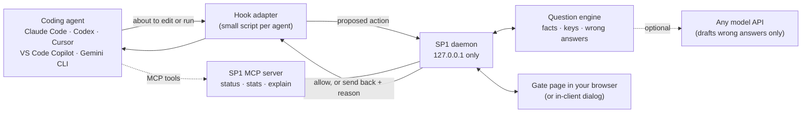

# SP1 Gate: design (draft v0.1)

*Status: 30 September 2026. Version 1 of the Claude Code gate is built and tested (`gate/`, see the README): two phases, questions computed without running the agent's code. The rest of this document is the full design; open decisions are in section 12.*

SP1 Gate sits between an AI coding agent and your computer. Before the agent edits a file or runs a command, you answer one to four multiple-choice questions about exactly what it's about to do. Which data structure does a line build? How does the running time grow? Which files does a command write? Where does a user's text end up?

The answers are computed from the code, not written by a model, so the agent that wrote the code can't write the quiz too. Get the questions right and the action runs. Miss one and you see why, then try again.

It's for people learning while they build with agents: college students, interns and junior engineers. It's designed to work with Claude Code, Codex, Cursor, VS Code Copilot and Gemini CLI. It needs no model API key, and it can use any provider when one is configured.

It grows out of the Stop Pressing 1 lab. The gate and the question lenses are the same, but the agent output is live and unscripted.

---

## 1. Decisions so far

| Decision (Sep 30, 2026) | Choice | What it means for the build |
|---|---|---|
| Delivery | MCP server | An MCP server **plus a small hook adapter per agent**. An MCP server only sees calls to its own tools, so the agent's hook is what actually holds an edit or command until you've answered. |
| When it asks (decided later on Sep 30) | Two phases | **Before an action:** 1–2 questions about its effects (files touched, downloads, installs, setup, security); then Claude Code's own "press 1". **After the agent's turn:** 1–3 questions about the code it wrote; the next message waits until they're answered. Plain code edits don't interrupt mid-turn. |
| Agents | Not only Claude | Claude Code first, then Codex, Cursor, VS Code Copilot and Gemini CLI, each through its own hook system (section 4). |
| Model providers | Any API key | The engine needs no model. A model is optional and only drafts extra wrong answers, through one library that talks to any provider (section 5). |
| Question format | Multiple choice only | Every answer key must be computable from the code. No free-text grading. |
| Audience | College students and adults | College-level questions: data structures, running time, logic, design, security, and code that calls LLMs. Mapped to the ACM/IEEE CS2023 curriculum. |
| Business | Bootstrap, open source, build reputation | Runs locally and free: no server for you to host, no API bill. Open-source license (section 12). |
| Privacy | Adults, multiple choice | Local-first. The real sensitivity is companies' source code, plus IRB review if answers become research data (section 8). |

## 2. Principles

Rules the code must keep, each with its reason.

1. **The answer key comes from the code, never from a model.**
   - Keys are computed by analyzing or running the code.
   - Models get it wrong. GPT-3.5 answered 399 generated multiple-choice questions about 60 programs it had written itself, and it was right 69% of the time. GPT-4, answering the same questions, was right 88% of the time. Both made mistakes seen in students, such as not tracing the code or tracing it wrongly (Lehtinen, Koutcheme & Hellas, 2024).
   - A quiz written by the system that wrote the code is the "verification theater" of the Stop Pressing 1 study (hypothesis H3).
2. **Only a person can answer.**
   - Questions and answers travel through a channel the agent can't read or write: the local gate page, or an in-client dialog.
   - The agent only ever learns "approved" or "sent back, because…".
3. **Ask only what can be proven.** For any non-trivial property of what a program computes, no algorithm decides it for every program (Rice, 1953). The engine only asks about facts it computed, saw by running the code, or measured. When it can't back a question up, it asks fewer questions instead of guessing.
4. **Run agent code only inside an OS sandbox.**
   - Some keys come from running the code, and that happens before anyone has approved it. That code could do anything the user can do.
   - So every run happens inside an operating-system sandbox: no network, writes only to a throwaway copy of the project, no access to the home folder, and a time limit.
   - Anthropic's open-source sandbox runtime (`srt`, Apache-2.0, a research preview) can enforce these rules with native OS sandboxing: `sandbox-exec` on macOS and bubblewrap on Linux, plus a proxy that filters network access. Its Windows support is in alpha.
   - Where no sandbox is available, the engine runs nothing and asks static questions only.
5. **Local-first.** The engine runs on the user's machine. With no model configured, no code leaves it.
6. **Fail closed, and say so.**
   - If the gate crashes or runs out of time, the action is sent back with a message.
   - In several agents, a hook that times out or fails doesn't block the action. In Claude Code, for example, the call continues through the normal permission flow. So each adapter keeps its own shorter deadline and answers "deny" before the agent's deadline runs out.
7. **A learning tool, not a security boundary.** It makes pressing 1 without reading costly. It can't stop a user who turns it off, or a determined adversarial agent. The README says so plainly.
8. **Vendor-neutral.**
   - MCP is an open standard. In December 2025 Anthropic donated it to the Agentic AI Foundation, a directed fund under the Linux Foundation co-founded by Anthropic, Block and OpenAI. MCP's own governance didn't change: its maintainers still run it.
   - Only the hook adapters are specific to one agent; everything else is shared.

## 3. Architecture



| Part | What it does | Notes |
|---|---|---|
| **Question engine** | Turns a proposed action into 0–4 verified questions | Python library, no network. The core of the project: see `QUESTION_ENGINE.md`. |
| **SP1 daemon** | Holds pending reviews, serves the gate page, keeps the learner model | Listens on 127.0.0.1 only, with a per-session token. Answer keys exist only in its memory. |
| **Gate page** | Shows the action and its questions; takes answers | Reuses the lab's Cobalt Grid review gate. |
| **Hook adapters** | Hand the action to the daemon, wait, then return allow or deny | A few dozen lines per agent (section 4). |
| **MCP server** | Lets the agent see the gate: `sp1_status`, `sp1_stats`, `sp1_explain` (after a decision) | Also offers the in-client dialog where supported, and gated `run`/`write` tools for agents without hooks. |

**Why a daemon and a browser page?**
- **People are slower than tool timeouts.** A person can take several minutes. Agents time out MCP tool calls much sooner:
  - Codex after 300 seconds by default since v0.141 (June 2026). Its docs still say 60.
  - Cursor's CLI at a hard-coded 60 seconds.
  - Claude Code moves a long MCP call to the background after 2 minutes, unless it's waiting on an elicitation dialog.
- **Hooks can wait longer:** 600 seconds by default in both Claude Code and Codex.
- **A local page behaves the same in every agent.**
- **It keeps answers off the agent's channel** (principle 2).

**Why not only the in-client dialog?** Support for MCP elicitation varies from client to client, and the 2026-07-28 spec changes how it works. A server no longer sends its own `elicitation/create` request. Instead, a tool call returns an `InputRequiredResult`, and the client calls again with the answer ("multi round-trip requests"). Until clients catch up, the dialog is an option, not the default.

## 4. How it plugs into each agent

| Agent | What holds the action | Default wait | Where you answer | Notes |
|---|---|---|---|---|
| **Claude Code** | `PreToolUse` hook on `Bash`, `Edit`, `Write`, `NotebookEdit`, `PowerShell` and MCP tools (`mcp__…`); returns `permissionDecision: allow` or `deny` | 600 s, configurable | Gate page, or the elicitation dialog (supported) | A hook that times out doesn't block: the call continues through the normal permission flow. So the adapter answers "deny" before its deadline. A hook can call an MCP tool directly (`mcp_tool`), but that lets the call through if the server isn't connected; use a `command` hook in strict setups. Installed as a managed hook, it can't be turned off by a project's `disableAllHooks`. |
| **Codex** (CLI, IDE) | `PreToolUse` hook: sees `Bash`, `apply_patch` edits and MCP calls; blocks with `permissionDecision: "deny"` or exit code 2 | 600 s | Gate page. Elicitation works when `approval_policy.granular.mcp_elicitations` is on. | `ask` isn't supported yet: Codex marks the hook as failed and runs the call. So the adapter only ever answers `deny`, or nothing. The docs don't say what a timed-out hook does, so the adapter denies before its deadline. Teams can set `allow_managed_hooks_only = true` in `requirements.toml`. |
| **Cursor** | `preToolUse` (Shell, Write, MCP) returns `allow` or `deny` | Not documented | Gate page; elicitation supported | Set `failClosed: true`. `ask` isn't enforced for `preToolUse`. |
| **VS Code Copilot** | `PreToolUse` hook (Preview) returns `allow`, `deny` or `ask` | **30 s**: raise it | Gate page; elicitation (since 1.102), shown in the same UI as the Ask Questions tool (since 1.112) | Hooks are in Preview. Claude and Codex sessions inside VS Code use those agents' own hooks. |
| **Gemini CLI** | `BeforeTool` hook returns `deny` | 60 s | Gate page (no elicitation support) | Other errors let the call through, so the adapter must deny explicitly. |
| **Devin Desktop** (formerly Windsurf) | `pre_write_code`, `pre_run_command` and `pre_mcp_tool_use` hooks block with exit code 2 | Not documented | Gate page | Block-only: any other exit code lets the action go ahead. System-level hooks can't be turned off by users without root. |
| **ChatGPT** (chat app) | — | — | — | It connects to remote MCP servers, but it doesn't edit your files or run commands, so there's nothing to gate. OpenAI's coding agent is Codex. |

Every row has a source in "Sources" below. These systems change monthly, so each adapter gets its own compatibility test (section 10).

## 5. Models: none required, any provider allowed

| Tier | Needs | What a model does | What never changes |
|---|---|---|---|
| **0 (default)** | Nothing | Nothing. Keys come from analysis and execution; wrong answers come from mutants and a misconception catalog. | Free, offline, private |
| **1 (optional)** | Your own API key, any provider | Drafts extra wrong answers and feedback wording, and proposes candidate fixes for design questions | The engine checks every draft and drops any that's actually right or can't be checked. A model is never the key. |

- **One interface for every provider.** LiteLLM (MIT-licensed core) calls Anthropic, OpenAI, Gemini, local models and 100+ other providers through one API. Which key to use is a setting, not code.
- **Not MCP sampling.** The 2026-07-28 MCP spec deprecates sampling, where a server borrows the client's model. Calling a provider's API directly doesn't depend on it.
- **Why drafts get checked.**
  - GPT-4 wrote good programming MCQs most of the time: 81.7% passed every quality check. But compared with human-written items, more of GPT-4's had several correct answers (4.9% vs 1.1%), and more had a wrong option that gave the answer away (4.0% vs 0.9%) (Doughty et al., 2024).
  - Of five models tested, the best, GPT-4o, matched close to 50% of the functional distractors originally written by humans (Hassany et al., 2025).
  - That makes model drafts a useful pool, not a finished product.
- **Provider data terms matter for companies.**
  - The Anthropic and OpenAI APIs don't train on API data by default.
  - Gemini's free tier may use prompts to improve Google's products, with human review; its paid tier doesn't.
  - Tier 0 sends nothing anywhere.

## 6. The gate: flow and modes

**Two phases (built in version 1).** Effects are knowable before an action runs, so phase 1 asks only about them: what a command downloads, installs, deletes or pushes, and what a sensitive file is for. Comprehension needs the finished code, so phase 2 waits for the end of the agent's turn and holds the person's next message instead of the agent. That removes the timeout problem for the longer questions: nothing is waiting on a timer while the person reads. It also builds in the habit that best protected learning in Anthropic's study: generate, then understand. In Claude Code the phases map to hooks:
- `PreToolUse` holds a risky command or edit and returns `ask` once the questions are answered, so the person still presses 1.
- `PostToolUse` records which files changed.
- `Stop` opens the questions about them.
- `UserPromptSubmit` blocks the next message until those questions are answered.

The numbered flow below is the general design; version 1 follows it with this split.

1. The agent proposes an edit or command, and the hook fires.
2. The adapter sends the diff or command to the daemon, plus the agent's message when the agent exposes it.
3. The daemon reviews one action at a time. If the agent sends several at once, the others wait, and each one's questions are built from the files as they are when its turn comes. *Why: approving one action can change what the next one does.*
4. The engine builds 0–4 questions within the current mode's budget.
5. **No questions:** a read-only `ls`, or a typo fixed in a comment, is allowed at once. *Why: a gate that asks about everything gets rubber-stamped too.*
6. **Otherwise:** the terminal says where to answer, and the gate page shows the action and its questions.
7. A wrong choice shows its feedback, as in the lab. The retry is a new variant: another input, or another question on the same concept, with the options reshuffled. So it can't be passed by crossing options off. The first try is what's scored.
8. You press **1** to approve, or **2** to send it back and name what's wrong.
9. The adapter returns allow, or deny with your reason. The reason becomes the agent's next instruction.
10. The learner model is updated, on your machine.

| Mode | For | Questions per action | Unlocks when |
|---|---|---|---|
| **Learn** (default) | Students | 2–4 | Every question is answered correctly (each retry is a new variant) |
| **Review** | Interns, juniors | 1–2 | First-try accuracy for the session stays at or above 70% (the pilot's success threshold); risky actions are always asked |
| **Strict** | Team policy for risky actions | At least 1, about the effects | Always asks about deletes, installs, network, secrets and edits to agent config. Can't be skipped. |
| **Fade** | Anyone, over time | Fewer as mastery grows | Stops asking about concepts you've mastered, one concept at a time |

**Why fading:** support that helps novices can stop helping, or even hurt, more experienced learners. This is the expertise reversal effect (Kalyuga et al., 2003).

**How mastery is tracked:** per concept, with knowledge tracing (Corbett & Anderson, 1994). See `QUESTION_ENGINE.md` section 10.

## 7. Security model

| Threat | Mitigation |
|---|---|
| The agent writes the quiz, for example with its own ask-the-user tool | Questions come only from the engine. The agent's question tools are never used for the gate. |
| The agent answers its own quiz | Questions and answers never enter the agent's context. Tool results carry no questions or keys. |
| The agent reads the key | Keys live only in the daemon's memory, never on disk. The gate page needs a per-session token. |
| The agent coaches the person ("pick C") | Option order and probe inputs come from a per-session secret the agent never sees, so it can't know which letter or input will be shown. Answers faster than anyone could read the question are flagged in the learner record. |
| Retrying until something works, by crossing options off | A retry is a new variant: another input, or another question on the same concept, with the options reshuffled. Only first tries count toward mastery. |
| A trace question answered from the docstring ("returns the index of `target`") instead of the code | Prefer questions the docstring can't answer: intermediate state ("what is `mid` the second time line 6 runs?"), or inputs where the code and its docstring disagree. |
| The gate itself runs code nobody has approved yet | Every run happens in an OS sandbox. With no sandbox, only static questions are asked (principle 4). |
| The agent turns the gate off: edits `.claude/settings.json`, `.codex/hooks.json` or `.cursor/hooks.json`, sets `disableAllHooks`, or adds an auto-answer hook | Edits to agent and hook config are Strict actions. "This edit turns off SP1 Gate" is asked every time. A managed install (last row) can't be turned off from a project's settings. |
| An approved command runs code the agent wrote: `pytest` runs its tests and `conftest.py`, and `npm test` runs its scripts | The command's questions cover the files it will run that changed since the last review. For stronger isolation, run the agent as a separate OS user that can't write hook config. |
| Parallel tool calls: approving one action changes what another will do | One review at a time. The next action's questions are rebuilt from the current files (section 6, step 3). |
| The agent routes around the hook (another tool that writes files) | Every tool is matched except a short read-only allowlist. |
| Code written to mislead: a comment saying `O(n)`, a function named `safe_run` | Keys ignore comments, docstrings and names. "Check the claim" questions set the claim against the computed fact on purpose. |
| Text in the code aimed at a model (Tier 1) | Code is passed to the model as data, and every draft is checked before use. |
| The gate crashes or times out | Fail closed with a message (principle 6). |
| A user turns hooks off | Out of scope for students: it's a learning tool (principle 7). Teams can install the adapter through managed settings, which a project's own settings can't turn off: managed hooks in Claude Code (with `allowManagedHooksOnly`), `allow_managed_hooks_only = true` in Codex's `requirements.toml`, Cursor's enterprise hooks file, and Devin's system-level hooks. |

In OWASP's Top 10 for Agentic Applications (2026), SP1 Gate is a control for:
- **ASI09 Human-Agent Trust Exploitation**: the approve-without-understanding failure that Stop Pressing 1 measures;
- **ASI02 Tool Misuse & Exploitation**;
- **ASI05 Unexpected Code Execution (RCE)**.

## 8. Data and privacy for adult users

- **What stays on the machine:** the engine, keys, answers and learner model, in `~/.sp1/`.
- **What leaves:** nothing in Tier 0. In Tier 1, the snippets needed to draft wrong answers go to the provider you chose. If that's the provider your agent already uses, it has that code already.
- **Multiple choice is still data.** Answers are stored locally so the questions can adapt. Nothing is uploaded; export is manual, as in the lab.
- **Research:**
  - Using students' answers in a study is human-subjects research, so get an IRB determination first.
  - Your IRB decides whether it's exempt, not you. OHRP recommends that investigators not decide it themselves.
  - The likely categories are normal educational practice and educational tests: 45 CFR 46.104(d)(1) and (d)(2).
- **College courses:** a college's records about a student are covered by FERPA. At a postsecondary institution the rights belong to the student.
- **Companies:** the concern is source-code confidentiality, and Tier 0 answers it, because nothing leaves the laptop.

## 9. Repository layout (proposed)

```
sp1-gate/
  engine/              the question engine (Python package)
    analyzers/         python_ast, treesitter, shell, taint, running_time
    run/               execution in an OS sandbox (srt): timeouts, no network, eight hash seeds
    mutants/           mutation operators + equivalence filtering
    catalog/           misconceptions, library costs, question families (YAML data, not code)
    select.py          risk, relevance, learner model, fading, budget
    validate.py        item rules: 4 options, 1 key, balance, answerable from the screen
  daemon/              localhost service: pending reviews, gate page, learner store
  ui/                  gate page (the lab's Cobalt Grid review gate)
  mcp/                 MCP server (official Python SDK v2 or FastMCP)
  adapters/            claude-code/, codex/, cursor/, vscode/, gemini-cli/
  gold/                real diffs + the facts and questions they must produce
  tools/               blind-audit packet (as in the lab), item analysis
  docs/                DESIGN.md, QUESTION_ENGINE.md
  poc/                 the proof of concept (delete once engine/ exists)
```

The engine is in Python for four reasons:
- `ast` gives deep facts about Python code.
- Hypothesis generates test inputs.
- tree-sitter parses other languages.
- The official MCP Python SDK (v2, MIT) implements the current spec.

The gate page stays HTML and JavaScript so it can reuse the lab.

## 10. Build order

| Phase | Deliverable | Why this order |
|---|---|---|
| 0 | Repo, CLAUDE.md, and a **gold set**: 20–30 real diffs from college-level tasks, each with the facts and questions it must produce | The gold set plays the role `project/` played in the lab: the ground truth every change is tested against. |
| 1 | Engine for Python + CLI (`sp1 quiz change.diff`) | The engine is the research contribution. Prove it on the gold set before wiring up any agent. |
| 2 | Daemon + gate page + Claude Code adapter (**version 1 built**, static questions only) | First end-to-end demo, in the agent you use daily. |
| 3 | Codex, Cursor, VS Code and Gemini CLI adapters + MCP tools; a compatibility test per agent | Backs the multi-agent claim with tests that catch the monthly changes. |
| 4 | Learner model and fading; optional Tier 1 through LiteLLM; JavaScript/TypeScript analyzers | Adaptivity comes after correctness. |
| Pilot | College students and interns; item analysis on real answers | Evidence for papers and talks (RSAC 2027 is April 5–8). |

## 11. What's new here

- **Approval gates** ask "approve?", not "do you understand?". Examples: the gotoHuman MCP server, and the human-in-the-loop features of the OpenAI Agents SDK, Vercel AI SDK and LangGraph.
- **Learning modes** teach while generating but don't hold an approval. Examples: Claude Code's Learning output style, ChatGPT study mode, Colab Learn Mode.
- **Quiz tools for AI-written code** quiz at pull-request or merge time, or after a turn. Examples: the pr-quiz GitHub Actions, SlopBlock, Gater, tidewave's pr-quiz, learning-with-claude.
  - SP1 Gate is different in when it asks: before each action runs.
  - It is different in where keys come from: they're computed from the code.
  - It is different in what it tracks: mastery per concept, across eleven lenses.
- **Research on questions about learners' own code (QLCs):**
  - Lehtinen, Santos & Sorva (2021) proposed QLCs, and the QLCpy library (MIT) implements nine question types for Python.
  - A third of students struggled to explain their own working code (Lehtinen, Lukkarinen & Haaranen, 2021).
  - SP1 Gate carries QLCs from students' own code to code an agent wrote. It adds running-time, design, security and LLM lenses, and it asks at the moment of approval.

## 12. Open decisions (for Rita)

1. **First agent:** Claude Code? Recommended: it has the richest hooks, supports elicitation, and it's what you use.
2. **Second language after Python:** JavaScript/TypeScript (web interns) or Java (college CS1/CS2)?
3. **License:** Apache-2.0 (patent grant; MCP's own repositories are moving to it) or MIT?
4. **Default answer surface:** the browser page everywhere, or the in-client dialog where the agent supports it?
5. **Gold set:** which 20–30 tasks? Assignments you already teach are the fastest source.
6. Item 6 of your message came through empty. Was there more?
7. **"Transictors":** did you mean *transistors* or *transactions*?
   - Transistors would mean how hardware runs code: number representation, memory use and caches. That's CS2023's Architecture and Organization area.
   - Transactions would mean databases and concurrency. That's CS2023's Data Management and Parallel and Distributed Computing areas.
   - Either could become a twelfth lens, and both need new analyzers.

---

## Sources

Checked 30 September 2026. Agent tools change often, so recheck before quoting defaults.

**MCP**
- Spec 2026-07-28: [changelog](https://modelcontextprotocol.io/specification/2026-07-28/changelog) · [elicitation](https://modelcontextprotocol.io/specification/2026-07-28/client/elicitation) · [deprecated features, including sampling](https://modelcontextprotocol.io/specification/2026-07-28/deprecated)
- Governance: [Anthropic, "Donating the Model Context Protocol and establishing the Agentic AI Foundation" (Dec 2025)](https://www.anthropic.com/news/donating-the-model-context-protocol-and-establishing-of-the-agentic-ai-foundation)

**Agents**
- Claude Code: [hooks](https://code.claude.com/docs/en/hooks) · [MCP](https://code.claude.com/docs/en/mcp) · [permissions](https://code.claude.com/docs/en/permissions) · [managed settings](https://code.claude.com/docs/en/managed-settings) · [changelog](https://github.com/anthropics/claude-code/blob/main/CHANGELOG.md)
- Codex: [hooks](https://learn.chatgpt.com/docs/hooks) · [MCP](https://learn.chatgpt.com/docs/extend/mcp?surface=cli) · [config reference](https://learn.chatgpt.com/docs/config-file/config-reference) · [managed configuration](https://learn.chatgpt.com/docs/enterprise/managed-configuration) · [PR #28234, MCP tool timeout raised to 300 s](https://github.com/openai/codex/pull/28234) · [release rust-v0.141.0](https://github.com/openai/codex/releases/tag/rust-v0.141.0)
- Cursor: [hooks](https://cursor.com/docs/agent/hooks) · [MCP](https://cursor.com/docs/context/mcp) · [forum post on the 60 s MCP timeout](https://forum.cursor.com/t/agent-acp-mcp-tools-call-times-out-at-60s-with-no-way-to-configure-it/163925)
- VS Code: [hooks](https://code.visualstudio.com/docs/agent-customization/hooks) · [hooks reference](https://code.visualstudio.com/docs/agents/reference/hooks-reference) · [1.102 release notes (elicitation)](https://code.visualstudio.com/updates/v1_102) · [1.112 release notes (elicitation UI)](https://code.visualstudio.com/updates/v1_112)
- Gemini CLI: [hooks reference](https://github.com/google-gemini/gemini-cli/blob/main/docs/hooks/reference.md) · [hooks overview](https://github.com/google-gemini/gemini-cli/blob/main/docs/hooks/index.md) · [elicitation issue #22249](https://github.com/google-gemini/gemini-cli/issues/22249)
- Devin Desktop: [hooks](https://docs.devin.ai/desktop/cascade/hooks)
- ChatGPT: [developer mode](https://developers.openai.com/api/docs/guides/developer-mode)

**Libraries**
- [LiteLLM](https://github.com/BerriAI/litellm) · [MCP Python SDK](https://github.com/modelcontextprotocol/python-sdk) · [QLCpy](https://github.com/teemulehtinen/qlcpy) · [sandbox-runtime (`srt`)](https://github.com/anthropic-experimental/sandbox-runtime)

**Data policies**
- [Anthropic: model training](https://privacy.claude.com/en/articles/7996868-is-my-data-used-for-model-training)
- [OpenAI: your data](https://developers.openai.com/api/docs/guides/your-data)
- [Gemini API terms](https://ai.google.dev/gemini-api/terms)

**Research rules**
- [45 CFR 46.104](https://www.ecfr.gov/current/title-45/subtitle-A/subchapter-A/part-46/subpart-A/section-46.104)
- [OHRP: who determines exemption](https://www.hhs.gov/ohrp/regulations-and-policy/guidance/faq/exempt-research-determination/index.html)
- [FERPA](https://studentprivacy.ed.gov/faq/what-ferpa)

**Security**
- [OWASP Top 10 for Agentic Applications (2026)](https://genai.owasp.org/resource/owasp-top-10-for-agentic-applications-for-2026/)

**Prior art**
- Approval gates: [gotoHuman MCP](https://github.com/gotohuman/gotohuman-mcp-server) · [OpenAI Agents SDK human-in-the-loop](https://openai.github.io/openai-agents-js/guides/human-in-the-loop/) · [Vercel AI SDK tool approvals](https://ai-sdk.dev/docs/agents/tool-approvals) · [LangChain human-in-the-loop](https://docs.langchain.com/oss/python/langchain/human-in-the-loop)
- Learning modes: [Claude Code output styles](https://code.claude.com/docs/en/output-styles) · [ChatGPT study mode](https://openai.com/index/chatgpt-study-mode/) · [Colab updates](https://blog.google/innovation-and-ai/technology/developers-tools/colab-updates/)
- Quiz tools: [dkamm/pr-quiz](https://github.com/dkamm/pr-quiz) · [revodatanl/pr-quiz](https://github.com/revodatanl/pr-quiz) · [SlopBlock](https://slopblock.pro/) · [Gater](https://usegater.app/) · [tidewave-ai/pr-quiz](https://github.com/tidewave-ai/pr-quiz) · [learning-with-claude](https://github.com/Tykok/learning-with-claude)

## References

- Corbett, A. T., & Anderson, J. R. (1994). Knowledge tracing: Modeling the acquisition of procedural knowledge. *User Modeling and User-Adapted Interaction, 4*(4), 253–278. https://doi.org/10.1007/BF01099821
- Doughty, J., et al. (2024). A comparative study of AI-generated (GPT-4) and human-crafted MCQs in programming education. *ACE '24*, 114–123. https://doi.org/10.1145/3636243.3636256
- Hassany, M., et al. (2025). Generating effective distractors for introductory programming challenges: LLMs vs humans. *LAK '25*, 484–493. https://doi.org/10.1145/3706468.3706529
- Kalyuga, S., Ayres, P., Chandler, P., & Sweller, J. (2003). The expertise reversal effect. *Educational Psychologist, 38*(1), 23–31. https://doi.org/10.1207/S15326985EP3801_4
- Lehtinen, T., Koutcheme, C., & Hellas, A. (2024). Let's ask AI about their programs: Exploring ChatGPT's answers to program comprehension questions. *ICSE-SEET '24*, 221–232. https://doi.org/10.1145/3639474.3640058
- Lehtinen, T., Lukkarinen, A., & Haaranen, L. (2021). Students struggle to explain their own program code. *ITiCSE '21*, 206–212. https://doi.org/10.1145/3430665.3456322
- Lehtinen, T., Santos, A. L., & Sorva, J. (2021). Let's ask students about their programs, automatically. *ICPC 2021*, 467–475. https://doi.org/10.1109/ICPC52881.2021.00054
- Rice, H. G. (1953). Classes of recursively enumerable sets and their decision problems. *Transactions of the American Mathematical Society, 74*(2), 358–366. https://doi.org/10.1090/S0002-9947-1953-0053041-6
