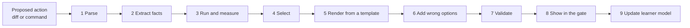

# How SP1 Gate writes questions about code it has never seen

*Draft v0.1, 30 September 2026. It describes the question engine in `DESIGN.md`. Every example in section 11 was produced by `poc/engine_poc.py` (Python 3.11), and its outputs and timings are real. Timings vary a little from run to run; `poc/out.txt` is the run shown here.*

An agent can propose any code, so the questions can't be written in advance the way they were for the lab. The engine has to read the proposed change, work out what's true about it, and turn those truths into SAT-style questions about data structures, running time, logic, design and security. Every question must have exactly one right answer, one the engine can prove.

---

## 1. The contract

1. **Four options, exactly one correct.** No "all of the above"; no free text.
2. **The key is computed.**
   - The engine gets the correct option in one of three ways:
     - analyzing the code (its syntax tree, scopes and data flow);
     - running it on concrete inputs inside an OS sandbox (`DESIGN.md`, principle 4);
     - measuring it on inputs of growing size.
   - A model never supplies the key, and neither does the agent's description of its own code.
3. **Every wrong option is checked wrong** by the same means. Each one is tied to a named bug or misconception, which becomes the feedback when someone picks it.
4. **If the engine can't prove it, it doesn't ask it.** Fewer questions is always acceptable; a question with a shaky key is not.

**Why these rules.**
- **Models aren't reliable keys.**
  - GPT-3.5 answered 399 automatically generated multiple-choice questions about 60 programs it had written itself, and it was right 69% of the time. GPT-4, answering the same questions, was right 88% of the time. Both made mistakes seen in students: not reading the question, not tracing the code, or tracing it wrongly (Lehtinen, Koutcheme & Hellas, 2024).
  - OpenAI Codex explained four programs line by line, five times each. Of its 174 line explanations, 117 (67%) were correct (Sarsa et al., 2022).
- **Nothing decides everything.** For any non-trivial property of what a program computes, no algorithm decides it for every program (Rice, 1953). So rule 4 isn't caution for its own sake; it's the only honest option.

## 2. The pipeline



1. **Parse.**
   - Find the changed lines and the language.
   - Python gets deep analysis through the standard `ast` module.
   - Other languages get structure from tree-sitter. The `tree-sitter-language-pack` bundle has pre-built grammars for hundreds of languages; prefetch them, because it downloads each parser on first use.
   - Shell commands are parsed too, because a command is an action with effects.
2. **Extract facts.**
   - Analyzers emit typed, line-anchored facts, for example `container(seen, list, line 3)` or `membership(e in seen, list, inside loop)`. Section 3 lists them.
   - Facts ignore comments, docstrings and names, which the agent controls.
3. **Run and measure.** Behavior questions need a *probe*: a concrete call. The engine looks for probes in this order:
   - the repo's tests;
   - the agent's own tests;
   - literals in the code;
   - inputs generated from the function's types or usage, with Hypothesis.

   How probes are run:
   - **Where it runs.** Each probe runs inside an OS sandbox (`DESIGN.md`, principle 4): its own process, no network, a throwaway copy of the files, and a time limit. Without a sandbox, this stage is skipped and only static questions are asked.
   - **Stability.** Each probe runs under eight different hash seeds. Any output that changes between runs is thrown away. So is any result that contains a set, because a set's printed order isn't fixed and a lucky run of seeds could hide that.
   - **Growth.** Running-time claims are also measured on inputs of growing size (section 6).
4. **Select.** Choose which facts become questions, based on:
   - which lines changed;
   - risk;
   - what this person has already mastered;
   - variety;
   - the mode's budget.

   Section 10 has the details.
5. **Render.** Each question comes from a *question family*: a stem template, a key rule and a wrong-option recipe, stored as data (section 4).
6. **Add wrong options:**
   - executed mutants first;
   - then the misconception catalog;
   - then true facts from elsewhere in the code;
   - then, optionally, model drafts.

   All are checked wrong (section 5).
7. **Validate.** Item rules, answerability and stability (section 9).
8. **Show** the question in the gate page. Line references highlight the code, and each wrong option carries its own feedback.
9. **Update** the learner model with first-try correctness.

## 3. What the engine can know: the fact catalog

| Analyzer | Facts it emits | How | v1 languages |
|---|---|---|---|
| Structure | functions, parameters, return points, classes, calls made inside the change | syntax tree | Python; others via tree-sitter |
| Data structures | the container behind each name (list, tuple, dict, set, deque, heap), how it's changed, membership tests, what kind of comprehension builds it | syntax tree + usage | Python |
| Control flow | loops (over what, how deeply nested), early exits, recursion and base cases, exceptions raised or caught | syntax tree | Python |
| Running time | a cost class per function, from known patterns plus a table of library costs (Python wiki "TimeComplexity"); "unknown" otherwise | rules, then measurement (section 6) | Python |
| Scope and state | locals rebuilt on every call, globals changed, mutable default arguments, two names for one list | syntax tree | Python |
| Effects | files read or written (and the mode), processes started, network calls (and the URL scheme), environment reads, shell redirection, destructive commands | syntax tree + shell parser | Python, shell |
| Dependencies | whether an import is standard library (`sys.stdlib_module_names`), third-party or local; installs; version pins; name distance to popular packages (typosquats) | syntax tree + package metadata | Python, shell |
| Taint | where values from parameters, requests, `input()` or files end up: prompts, model calls, shell, SQL, `eval`, HTML | data flow within a function | Python |
| LLM integration | SDK calls (Anthropic, OpenAI, Gemini, LiteLLM), how prompts are built, where replies go, tools given to a model, limits like `max_tokens` | syntax-tree patterns | Python |
| Tests | which changed functions have tests, and what each test checks | syntax tree | Python |
| Agent claims | sentences in the agent's message ("only uses the standard library", "cached", "O(n)") matched to the fact that confirms or contradicts them | pattern matching; a model may *find* claims, never judge them | any |

## 4. The eleven lenses, and the question families

The lenses are the Stop Pressing 1 comprehension taxonomy. **LLM integration is new** and has become lens 11. Each lens is mapped to the ACM/IEEE-CS/AAAI curriculum CS2023 (Kumar, Raj et al., 2024), so questions line up with college course outcomes.

| # | Lens | What it asks | CS2023 knowledge areas |
|---|---|---|---|
| 1 | Action-level | What approving this will actually change | SF (Systems Fundamentals), OS |
| 2 | Dependencies and supply chain | Where code comes from; what gets installed | SE, SEC |
| 3 | Data structures and data flow | Which structure, what it holds, where values go | SDF, AL |
| 4 | Algorithms and complexity | Tracing, counting, running time | AL |
| 5 | Correctness and edge cases | Boundaries, empty input, exceptions | SDF, SE |
| 6 | Security consequences | What can leak, break or run | SEC |
| 7 | Systems and execution context | Shell, processes, files, network | SF, OS, NC |
| 8 | Engineering and change management | Tests, pins, commits | SE |
| 9 | Abstraction and design reasoning | What changes if the design changes | SE, FPL |
| 10 | Meta-comprehension of the agent | Does the code do what the agent said? | SE, SEP |
| 11 | **LLM integration** (new) | Prompts, model output, agency, limits | AI, SEC |

**Question families** are reusable templates. The key column says where the correct option comes from; the last column says where wrong options come from.

| ID | Lens | Stem (template) | Key from | Wrong options from |
|---|---|---|---|---|
| DS-1 | 3 | What data structure is `x` (line N), and what does it hold? | container fact | other containers + "`{}` is a set" |
| DS-2 | 3/4 | What does `a in b` cost when `b` holds k items? | library cost table | costs of other containers |
| DS-3 | 3 | After line N runs on this input, what is `x`? | execution snapshot | executed mutants |
| DS-4 | 3 | `b = a`, then `b.append(…)`. What is `a` now? | execution | "assignment copies" misconception |
| AL-1 | 4 | What does `f(args)` return? | execution | executed mutants |
| AL-2 | 4 | How many times does line N run for this input? | line counts from a trace | mutants; off-by-one neighbours |
| AL-3 | 4 | How does the running time grow with n? | pattern rules, confirmed by measurement | rule-specific misconceptions (section 6) |
| AL-4 | 4 | How deep does the recursion go for this input? | execution | mutants; RecursionError |
| EC-1 | 5 | What happens for `[]`, one item, or a value exactly at the threshold? | execution | boundary mutants |
| EC-2 | 5 | Which exception does line N raise, and for what input? | generated inputs + execution | other exception types |
| DE-1 | 9 | If `x` were a set instead of a list, what would change? | both versions run and measured | misconceptions, each checked wrong |
| DE-2 | 9/6 | Which change would stop X? | each option analyzed or tested as code | the options that fail |
| DE-3 | 9 | What would change if line N didn't use `with`? | reviewed semantics catalog | construct misconceptions |
| ST-1 | 3 | What happens to `x` between calls? | scope rule | lifetime and scope misconceptions |
| ST-2 | 5 | What does `f()` return the second time it's called? | execution (mutable defaults) | mutants |
| SY-1 | 1/7 | Which files will this command write to? | shell parser + effect model | files it only reads; files it doesn't touch |
| SY-2 | 7 | What does `>` (or `&&`, `\|`) do here? | reviewed shell-semantics catalog | `>>`, `\|\|`, and so on |
| DP-1 | 2 | Where does module X come from? | stdlib list, installed metadata | "`import` downloads it", "`pip` is built in" |
| DP-2 | 2 | Exactly which package will this install? | parsed command | nearby popular names |
| SE-1 | 6/11 | Someone controls `x`. Which statement about where it goes is true? | taint path to a sink | partial paths; misconceptions |
| LL-1 | 11 | Which values can change what the model is asked? | taint into the prompt | constants, config values |
| LL-2 | 11 | What caps the length of this model call's reply? | the SDK's output-limit argument: `max_tokens` (Anthropic, where it's required), `max_completion_tokens` or `max_output_tokens` (OpenAI), `max_output_tokens` (Gemini); loops around the call | an instruction in the prompt ("reply with one command"), which is a request, not a limit; the prompt's length |
| MC-1 | 10 | The agent says X. What does the code actually do? | computed fact | the mutant that would make the claim true |

**Design questions are counterfactuals.** "Why did the agent use a set?" has no computable answer, because intent can't be observed. "What would change if it were a list?" does: run both versions and compare their results and running times. Fix-selection questions (DE-2) work the same way. Each option is a small code change, and the analyzer or the tests decide which one works. That's how "the choice of the design" gets a provable key.

**Depth.** Every question is tagged with a Block Model level (atoms, blocks, relations, macro structure) and dimension (text surface, program execution, function or purpose) (Schulte, 2008). It also gets a revised-Bloom process (Anderson & Krathwohl, 2001). Selection uses the tags to climb from reading one line to reasoning about the whole change.

## 5. Where wrong options come from

In priority order:

1. **Executed mutants.**
   - The same code with one small, realistic bug, run on the same probe:
     - a flipped comparison (`<=` to `<`)
     - an inverted test (`in` to `not in`)
     - a dropped `+ 1`
     - a missing `if` check
     - a list swapped for a set
     - a local moved to module level
   - This rests on the *competent programmer hypothesis*: real programs are usually close to correct, so realistic errors are small ones (DeMillo, Lipton & Sayward, 1978; Jia & Harman, 2011).
   - A mutant's output is exactly what a person believes if they misread the code in that one way. So picking it is diagnostic, and the feedback can name the misreading.
   - Housekeeping:
     - A mutant that returns the same output as the real code is dropped automatically.
     - Output that changes across the eight hash seeds is dropped, and so is any result that contains a set.
     - A mutant that only times out is dropped. A timeout proves nothing, so it's never a key or a wrong option.
     - "Nothing: the loop never ends" needs proof. The `while` loop must make no calls, and the same line must run twice with the same values in every variable. In deterministic code, a repeated state repeats forever.
     - A crash becomes "it raises KeyError".
2. **The misconception catalog.** Documented wrong beliefs, each stored with the fact type that triggers it, the wrong answer's template, its feedback and a source. Sources:
   - novice programming misconceptions (Qian & Lehman, 2017);
   - notional-machine errors (Sorva, 2013);
   - algorithm and data-structure misconceptions (Danielsiek, Paul & Vahrenhold, 2012);
   - difficulties analyzing the running time of short code (Albluwi & Zeng, 2021).

   Where it can, the engine checks each entry too. "Sets would be slower" is measured and shown false for lists of 1,000 to 8,000 emails (section 11). For a handful of items it can be true, which is why that stem says "when `emails` is long".
3. **Sibling facts.** True facts from elsewhere in the same code, offered as the answer to a different question. They're plausible because they're on screen.
4. **Model drafts (optional).** Candidates only. Each is checked by the engine and dropped if it's actually right or can't be checked:
   - GPT-4's programming MCQs were mostly good (81.7% passed every quality check), but more of them than of human-written ones had two right answers or a giveaway wrong option (Doughty et al., 2024).
   - Of five models tested, the best, GPT-4o, matched close to 50% of the functional distractors humans had written (Hassany et al., 2025).

**How the four options are chosen.**
- Options come from different sources and bug classes where possible, so each wrong answer diagnoses something different.
- Options nobody picks during pilots are replaced (Gierl et al., 2017; Haladyna, Downing & Rodriguez, 2002).

## 6. Running-time questions, without bluffing

No analyzer can find the running time of arbitrary code. The engine asks a running-time question only when **three conditions** hold:

1. **A known pattern fires, with nothing unknown in the loop.** Patterns:
   - loops over the input;
   - nested loops;
   - halving loops, where each pass either returns or moves `lo` above `mid` or `hi` below it (a loop that can leave its range unchanged doesn't count);
   - list scan vs hash lookup for `in`;
   - sorting;
   - `insert(0, …)`.

   Costs come from a library table (Python wiki "TimeComplexity").
2. **Measurement doesn't contradict it.**
   - The engine times the code on inputs of growing size: one warm-up run, then the best of at least five runs at each size. It fits the growth exponent: the slope of log time against log n.
   - If a busy computer throws the fit off, it measures again, up to three times. If the fit still disagrees, the question isn't asked.
   - The exponent must match the rule's polynomial degree within 0.3.
   - Timing can't see log factors. At sizes that run in seconds, it can't tell log n from a constant, or n log n from n. So for log factors the rule alone is the evidence, and the question's evidence says so.
   - Measurement can't prove a worst case either. It catches rules that fired wrongly.
3. **The stem pins down the input.** For example, "`emails` holds n *different* addresses", so worst case and best case can't be confused.

**Options are tight bounds (Θ).** Big-O is only an upper bound, so a binary search is O(log n), but also O(n) and O(n log n): three options would be true at once. With Θ ("grows in proportion to"), exactly one is.

**Wrong options for running-time questions** depend on which rule fired:

| Rule | Wrong option | The misconception it names |
|---|---|---|
| Hidden list scan in a loop | Θ(n) | "One loop means linear time" |
| Any | Θ(1) | Best case taken for worst case |
| List scan | Θ(n log n) | "`in` searches a list by halves" |
| Halving loop | Θ(n) | "Every loop visits every element" |
| Halving loop | Θ(n log n) | Search confused with sorting |

In the proof of concept, `first_repeat` was estimated at Θ(n²) and measured at an exponent of **2.02**. The set version was estimated at Θ(n) and measured at **1.18**, and it was faster at every size tried (section 11). `find_index` wasn't timed: its Θ(log n) key rests on the halving rule alone.

## 7. Tracing and edge cases: let the program answer

For AL-1, AL-2, EC-1 and DS-3, the key is simply what happens when the code runs on the probe. Three sources back this approach:
- In Jask, questions about program dynamics tended to score low: four of its five dynamics questions scored below 50%, while most questions about static aspects scored above 80%. The authors read this as "possibly evidencing fragile comprehension of programming constructs" (Santos et al., 2022). That makes execution a valuable place to ask.
- Novices' trouble with how programs run is the "notional machine" problem (Sorva, 2013).
- In Anthropic's 2026 experiment, the largest gap between people who learned with AI help and people who didn't was on debugging questions (Shen & Tamkin, 2026).

Edge-case questions pick inputs where mutants disagree with the real code. By construction, those inputs sit at a boundary.

**Don't let the docstring answer.** A trace question can sometimes be answered from the docstring or the function's name instead of the code. `find_index` says it returns the index of `target`, so "what does `find_index([3, 8, 15, 21, 42], 42)` return?" can be answered without tracing (example B). The engine prefers probes that need the code:
- intermediate state, such as "what is `mid` the second time line 6 runs?";
- inputs where the code and its docstring disagree, which is also where the bugs are.

## 8. LLM-integration questions (lens 11)

Code that calls a model is becoming ordinary college code, and it has its own failure modes. The facts come from SDK-call patterns plus taint. The questions map to the OWASP Top 10 for LLM Applications (2025):

| Fact | Question family | OWASP |
|---|---|---|
| Untrusted text is formatted into a prompt | LL-1, SE-1 | LLM01 Prompt Injection |
| A model's reply reaches a shell, SQL, `eval` or HTML | SE-1, DE-2 | LLM05 Improper Output Handling |
| A model is given tools that act | SE-1 | LLM06 Excessive Agency |
| Secrets or personal data go into a prompt | LL-1 | LLM02 Sensitive Information Disclosure; LLM07 System Prompt Leakage |
| No output limit (optional in the OpenAI and Gemini SDKs; Anthropic requires `max_tokens`), or calls in an unbounded loop | LL-2 | LLM10 Unbounded Consumption |

People using an AI assistant have written less secure code while believing it was more secure (Perry et al., 2023). That is the argument for making the security and LLM lenses a required part of Strict mode.

## 9. Validation: every question, before it's shown

- Four options, exactly one of which passes the key check. The other three have been checked wrong.
- Options are distinct after normalizing whitespace and quotes, and similar in length. The engine tracks how often the key is the longest option and keeps it near 25%, so "pick the longest" doesn't work (Haladyna, Downing & Rodriguez, 2002).
- **Answerable from the screen:** every line a question mentions is visible in the gate page.
- **Stable:** the key is the same under eight hash seeds, and it contains no set.
- **Unpredictable to the agent:** option order and probe inputs come from a per-session secret seed. (The proof of concept uses a fixed seed so its output can be reproduced.)
- **A retry is a new variant:** after a miss, the next attempt uses another input, or another question on the same concept when there's no input to vary, with the options reshuffled. So no one passes by crossing options off.
- **A time budget** of about 30–60 seconds per question. Items that take longer in pilots get split.
- **Optional blind self-check** (Tier 1): a model answers without seeing the key. A disagreement flags the question as possibly ambiguous for review; it never changes the key.
- **A "this question seems wrong" button.** In an introductory course where GPT-4o mini generated questions about students' own code, students flagged 1.2% of 4,704 questions (Goodfellow et al., 2026).

## 10. Choosing what to ask

1. **Candidates:** every (fact, family) pair whose key the engine can compute.
2. **Filter:** drop anything not answerable from the screen, and anything asked about the same fact recently.
3. **Score:**
   - relevance: a changed line counts more than surrounding context;
   - risk: effects, security and LLM facts count double;
   - need: 1 minus the person's current mastery of the concept;
   - novelty.
4. **Pick** by score within the mode's budget: at most one question per lens, except in Strict mode.
5. **Order:** procedural questions first (what happens, in what order), then functional ones (what it's for, what if it changed). Programmers' first understanding of code is procedural; a functional understanding develops later, as they work with it (Pennington, 1987).

**Learner model.**
- Each concept is a pair: a lens and a fact type, such as "membership cost: list" or "shell: `>` truncates".
- Each concept gets a Bayesian Knowledge Tracing estimate (Corbett & Anderson, 1994), updated from first-try answers. With four options, the guess parameter starts at 0.25.
- Concepts above a mastery threshold fade out. The threshold is tunable (for example 0.95) and set in pilots (expertise reversal: Kalyuga et al., 2003).
- Concepts that were missed come back later as spaced retrieval practice. In a lab study, taking tests improved long-term retention more than restudying (Roediger & Karpicke, 2006). In real classrooms, retrieval practice consistently helps too (Agarwal, Nunes & Blunt, 2021).
- Tracing and edge-case families get extra weight because of the debugging gap (Shen & Tamkin, 2026).

## 11. Worked examples from the proof of concept

All four are real outputs of `python3 poc/engine_poc.py`, copied from `poc/out.txt`. Options appear in the order the engine shuffled them. ✓ marks the key. The label in brackets says where each wrong option came from, and the text after it is the feedback a person sees when they pick it.

### A. Running time and a design counterfactual

```python
  1  def first_repeat(emails):
  2      """Return the first email that appears twice, or None if all are different."""
  3      seen = []
  4      for e in emails:
  5          if e in seen:
  6              return e
  7          seen.append(e)
  8      return None
```

**AL-3.** `emails` holds n different addresses. How does the running time of `first_repeat` grow as n grows?

- A. Θ(n) · [misconception: hidden loop] One visible loop, but `in` on a list is a hidden loop over `seen`.
- B. Θ(n log n) · [misconception: lists are searched like sorted arrays] `in` on a list doesn't search by halves; lists aren't kept sorted.
- C. Θ(1) · [misconception: best case taken for worst case] It returns early only when it finds a repeat. With n different addresses it never does, so it checks everything.
- **D. Θ(n²)** ✓

*Key:* the loop rule plus the list-scan rule. The loop runs n times, and `e in seen` scans a list that grows by one each pass, so the checks add up to 0 + 1 + … + (n − 1) = n(n − 1)/2 comparisons. Measured on n = 1,000 to 8,000 different addresses (best of at least five runs at each size), the time grew with exponent **2.02**. The largest size took 0.23 s.

**DE-1.** A reviewer suggests changing line 3 to `seen = set()` and line 7 to `seen.add(e)`. What would change when `emails` is long?

- A. It gets faster, but it can return a different email, because sets have no order · [misconception: set order leaks into the result] The order that matters here is the loop's order over `emails`, which doesn't change. `seen` is only asked yes/no questions.
- **B. Same results, and the running time becomes Θ(n) on average instead of Θ(n²)** ✓
- C. Nothing: `in` checks a set item by item, just like a list · [misconception: all containers are scanned] Sets are hash tables: `in` jumps to where the item would be instead of scanning.
- D. It gets slower, because hashing an email costs more than comparing two emails · [misconception: constant cost mistaken for growth] Hashing costs a little per lookup, but it replaces a scan of the whole list. Measured, the set version was faster at every size tried, from 1,000 to 8,000 emails.

*Key:* the engine checked both parts of the answer.
- Same results: both versions return `'bo@x.io'` on the probe and agree on 50 random inputs.
- Running time: estimated Θ(n), measured exponent **1.18**. At n = 8,000 it took 0.0005 s against 0.23 s for the list: about 480× faster.
- "On average" is in the key because many hash collisions could make lookups slower.

### B. Tracing with executed mutants

```python
  1  def find_index(nums, target):
  2      """Return the index of target in the sorted list nums, or -1."""
  3      lo, hi = 0, len(nums) - 1
  4      while lo <= hi:
  5          mid = (lo + hi) // 2
  6          if nums[mid] == target:
  7              return mid
  8          if nums[mid] < target:
  9              lo = mid + 1
 10          else:
 11              hi = mid - 1
 12      return -1
```

**AL-1.** What does `find_index([3, 8, 15, 21, 42], 42)` return?

- **A. `4`** ✓
- B. `2` · [executed mutant] You'd get this if line 7 ran without the check `if nums[mid] == target:` on line 6: a missing check.
- C. Nothing: the loop never ends · [executed mutant] You'd get this if line 9 used `mid` instead of `mid + 1`: an off-by-one bug.
- D. `-1` · [executed mutant] You'd get this if line 4 read `lo < hi` instead of `lo <= hi`: a boundary (off-by-one) bug.

*Key:* running the real code. Traced: lo=0, hi=4 → mid=2 (15 < 42, so lo=3) → mid=3 (21 < 42, so lo=4) → mid=4, and `nums[4]` is 42, so it returns 4.
- The engine tried six mutants. Three gave the same answer as the real code on this input, so they were dropped.
- The other three became the wrong options. Each is a classic binary-search bug.
- Option C is proven, not guessed. With `lo = mid`, the loop reaches lo=3, hi=4, mid=3 twice. The loop makes no calls, so the same state repeats forever.
- **A weakness this example shows:** the docstring says the function returns the index of `target`, so someone can answer A without tracing. The real engine would rather ask "what is `mid` the second time line 6 runs?" (section 7).

A second question, **AL-3**, has key Θ(log n). Each pass either returns or moves `lo` above `mid` or `hi` below it, so the range still in play at least halves. Its wrong options are Θ(n), Θ(1) and Θ(n log n). It isn't timed: at these sizes timing can't tell log n from a constant, so the rule is the evidence.

### C. Checking the agent's claim

```python
 11  def get_profile(user_id):
 12      cache = {}
 13      if user_id not in cache:
 14          cache[user_id] = fetch_profile(user_id)
 15      return cache[user_id]
```

**MC-1.** Wren says: "I added a cache, so repeated lookups skip the slow fetch." When `get_profile(7)` is called three times in a row, how many times does `fetch_profile` run?

- **A. 3 times** ✓
- B. 1 time · [executed mutant] You'd get this if `cache = {}` sat at module level instead of inside `get_profile`: state that lasts between calls.
- C. 6 times · [misconception: a lookup re-runs the function] Reading `cache[user_id]` on line 15 only looks up the dict. It doesn't call `fetch_profile` again.
- D. It raises KeyError · [executed mutant] You'd get this if line 13 read `user_id in cache` instead of `user_id not in cache`: an inverted test.

*Key:* the code ran with a counter wrapped around `fetch_profile`. Each call starts with an empty `cache`, so every call fetches. Option B comes from the mutant that makes the agent's claim true. It's the most tempting wrong answer, and picking it shows the reader believed the claim.

The companion **ST-1** question ("Line 12 creates `cache` inside `get_profile`. What happens to `cache` between calls?") has key "Each call makes a new, empty `cache`; nothing carries over". That key comes from the scope rule: `cache` is assigned on line 12, at the top level of the function, with no `global` or `nonlocal`.

### D. LLM integration: where the ticket text goes, and which fix works

```python
  8  def fix_ticket(ticket_text):
  9      """Ask the model for a shell command that fixes the ticket, then run it."""
 10      prompt = f"Reply with one shell command that fixes this issue:\n{ticket_text}"
 11      reply = client.messages.create(
 12          model="claude-sonnet-5-5",
 13          max_tokens=100,
 14          messages=[{"role": "user", "content": prompt}],
 15      )
 16      command = reply.content[0].text
 17      subprocess.run(command, shell=True)
```

**SE-1.** Whoever writes the ticket controls `ticket_text`. Which statement about their text is true?

- A. It reaches line 17 as text that `shell=True` displays but doesn't run · [misconception: shell=True] `shell=True` hands the whole string to the system shell, which runs it as a command.
- B. It reaches the model, but the model's reply doesn't depend on it · [misconception: model output is independent of its input] A model's reply depends on everything in its prompt, and the ticket is in the prompt.
- C. It can't reach line 17, because `max_tokens=100` limits the reply · [misconception: limits mistaken for controls] `max_tokens` caps how long the reply is, not what it says. It doesn't cap the prompt either: a long ticket still costs more.
- **D. It can shape the shell command that line 17 runs, via the reply** ✓

*Key:* the taint path. `ticket_text` goes into `prompt` (line 10), the prompt goes to the model (line 11), the reply becomes `command` (line 16), and line 17 runs it with `shell=True`. Text in a model's prompt can shape its reply (OWASP LLM01), and running a reply unchecked is improper output handling (OWASP LLM05). The four options are parallel statements, none with "only" or "nothing", so the key can't be spotted by its wording.

**DE-2.** Which change stops the ticket text from writing the command that runs?

- **A. Run only a preset command that the model picks by name** ✓
- B. Remove `;`, `&&` and `|` from the reply before running it · [misconception; the analyzer still finds the path] One command can do harm on its own (for example `rm -rf ~`), and a blocklist misses `$( )`, backticks and more. The reply is still the command.
- C. Print `command` before running it · [misconception; the analyzer still finds the path] Printing records the command; the next line still runs it.
- D. Add "Never reply with a dangerous command." to the prompt · [misconception; the analyzer still finds the path] An instruction in the prompt is not a security boundary: the ticket text sits in the same prompt and can argue with it (OWASP LLM01, prompt injection).

*Key:* each option was written as code (`poc/examples/fix_ticket_options.py`) and run through the same taint analysis. The analyzer found one path from `ticket_text` to the command in each wrong option, and none in the allowlist version, where the command comes from a table of constants.
- The stem says "writing" on purpose. With the allowlist, the ticket can still influence *which* preset runs, or whether any does. The question doesn't claim otherwise.
- The analyzer accepts a lookup table as safe only if the table is never changed, stored into, declared `global` or assigned twice.

## 12. The research behind each choice

| Design choice | What the evidence says | Source |
|---|---|---|
| Ask about the code at the moment it would be accepted | QLCs were proposed for exactly this moment. A third of students struggled to explain their own working code. 90% solved the rainfall problem, yet 27% failed at least one simple question about their own solution. | Lehtinen, Santos & Sorva 2021; Lehtinen, Lukkarinen & Haaranen 2021; Lehtinen, Seppälä & Korhonen 2023 |
| Hold the approval until the questions are answered | Cognitive forcing functions reduced overreliance on AI. Of seven engagement techniques for AI-generated code, Lead-and-Reveal, Trace-and-Predict and Solve-Code-Puzzle looked most effective at improving learners' own coding, though the differences weren't statistically significant. In a follow-up study, only Lead-and-Reveal improved how well learners' self-assessment matched their actual ability. Trace-and-Predict took 2.66 times as long as the baseline and added more friction. SP1 Gate's tracing questions resemble Trace-and-Predict, which is one more reason for budgets and fading. | Buçinca, Malaya & Gajos 2021; Kazemitabaar et al. 2025 |
| Why it matters for AI-assisted learners | The AI group averaged 50% on the quiz vs 67% for hand-coders (Anthropic's summary); the biggest gap was on debugging; "generation-then-comprehension" users kept their learning. Struggling novices end with "an illusion of competence". AI-assisted participants wrote less secure code and believed it more secure. | Shen & Tamkin 2026; Prather et al. 2024; Perry et al. 2023 |
| Keep people alert when the agent is usually right | Complacency grows when automation is usually reliable | Parasuraman & Manzey 2010 |
| Compute keys; never take them from a model | On 399 multiple-choice questions about programs GPT-3.5 wrote, GPT-3.5 was right 69% of the time and GPT-4 88%. Codex's line-by-line explanations were correct 67% of the time. | Lehtinen, Koutcheme & Hellas 2024; Sarsa et al. 2022 |
| Ask only what can be proven | For any non-trivial property of what programs compute, no algorithm decides it for every program | Rice 1953 |
| Favor questions about how the code runs | Dynamics questions tended to score low in Jask; novices lack a working model of the machine | Santos et al. 2022; Sorva 2013 |
| Wrong options from small mutants | Competent programmer hypothesis; coupling effect | DeMillo, Lipton & Sayward 1978; Jia & Harman 2011 |
| Wrong options from documented misconceptions | Catalogs of novice, algorithm/data-structure and running-time difficulties | Qian & Lehman 2017; Danielsiek et al. 2012; Albluwi & Zeng 2021 |
| Item-writing rules; prune unused distractors | Standard MCQ guidance; review of distractor development and analysis | Haladyna et al. 2002; Gierl et al. 2017 |
| Model drafts only as checked candidates | 81.7% of GPT-4's MCQs passed every quality check, but it produced more multi-answer and giveaway items than humans did. The best of five models (GPT-4o) matched close to 50% of human-written functional distractors. In one intro course, students flagged 1.2% of 4,704 generated questions. | Doughty et al. 2024; Hassany et al. 2025; Goodfellow et al. 2026 |
| Question types that match real review work | 44 kinds of questions programmers ask while changing code; understanding is "the key aspect of code reviewing" | Sillito et al. 2006, 2008; Bacchelli & Bird 2013 |
| Climb from lines to whole-change reasoning | Procedural understanding comes first; the Block Model's levels × dimensions; revised Bloom | Pennington 1987; Schulte 2008; Anderson & Krathwohl 2001 |
| Adapt per concept, and fade | Knowledge tracing; the expertise reversal effect | Corbett & Anderson 1994; Kalyuga et al. 2003 |
| The gate is also practice | Taking tests improved long-term retention in a lab study; retrieval practice consistently helps in classrooms | Roediger & Karpicke 2006; Agarwal et al. 2021 |
| College mapping; LLM lens | CS2023 knowledge areas; OWASP LLM Top 10 (2025) | Kumar, Raj et al. 2024; OWASP 2025 |

## 13. Limits and open problems

- **Python first.** Other languages get structural facts (which files change, the imports, loop nesting) until they have their own analyzers.
- **Probes.** Without tests or type hints, generated inputs may miss interesting paths. Then there are fewer execution questions, not weaker ones.
- **Side effects.** Functions that touch files or the network aren't executed; the engine asks static questions instead, or runs them against mocks.
- **Running code needs an OS sandbox.** A subprocess with a timeout limits accidents, not attacks. Where no sandbox is available, execution and timing questions are off, and the gate asks fewer, static questions.
- **"Same results" is tested, not proven.** Agreement on the probe plus N generated inputs is evidence, and the stem's wording must not claim more.
- **Measurement is noisy, and blind to log factors.** Tolerances, warm-up runs and best-of-several timing keep false rules out, but the rule, not the timing, is the key. For log n and n log n, timing adds no evidence at all.
- **Docstrings and names can give answers away** (section 7). Preferring intermediate state costs some question variety.
- **Concurrency and transactions** (CS2023 PDC and DM) need interleavings explored before the engine can prove anything. **Hardware-level questions** (how numbers are stored, memory use; CS2023 AR) are easier: many can be answered by running the code. Both are candidates for a later lens.
- **Item quality needs data.** Difficulty and distractor choice rates come from pilots; the lab's blind-audit tool carries over.

## References

- Agarwal, P. K., Nunes, L. D., & Blunt, J. R. (2021). Retrieval practice consistently benefits student learning: A systematic review of applied research in schools and classrooms. *Educational Psychology Review, 33*(4), 1409–1453. https://doi.org/10.1007/s10648-021-09595-9
- Albluwi, I., & Zeng, H. (2021). Novice difficulties with analyzing the running time of short pieces of code. *ACE '21*. https://doi.org/10.1145/3441636.3441855
- Anderson, L. W., & Krathwohl, D. R. (Eds.). (2001). *A taxonomy for learning, teaching, and assessing: A revision of Bloom's taxonomy of educational objectives*. Longman.
- Bacchelli, A., & Bird, C. (2013). Expectations, outcomes, and challenges of modern code review. *ICSE 2013*, 712–721. https://doi.org/10.1109/ICSE.2013.6606617
- Buçinca, Z., Malaya, M. B., & Gajos, K. Z. (2021). To trust or to think: Cognitive forcing functions can reduce overreliance on AI in AI-assisted decision-making. *Proc. ACM Hum.-Comput. Interact., 5*(CSCW1), Article 188. https://doi.org/10.1145/3449287
- Corbett, A. T., & Anderson, J. R. (1994). Knowledge tracing: Modeling the acquisition of procedural knowledge. *User Modeling and User-Adapted Interaction, 4*(4), 253–278. https://doi.org/10.1007/BF01099821
- Danielsiek, H., Paul, W., & Vahrenhold, J. (2012). Detecting and understanding students' misconceptions related to algorithms and data structures. *SIGCSE '12*, 21–26. https://doi.org/10.1145/2157136.2157148
- DeMillo, R. A., Lipton, R. J., & Sayward, F. G. (1978). Hints on test data selection: Help for the practicing programmer. *Computer, 11*(4), 34–41. https://doi.org/10.1109/C-M.1978.218136
- Doughty, J., et al. (2024). A comparative study of AI-generated (GPT-4) and human-crafted MCQs in programming education. *ACE '24*, 114–123. https://doi.org/10.1145/3636243.3636256
- Gierl, M. J., Bulut, O., Guo, Q., & Zhang, X. (2017). Developing, analyzing, and using distractors for multiple-choice tests in education: A comprehensive review. *Review of Educational Research, 87*(6), 1082–1116. https://doi.org/10.3102/0034654317726529
- Goodfellow, M., Lambert, A., Booth, R., & Fagan, A. (2026). From code to questions: Leveraging generative AI to support code comprehension in introductory programming. *Human-Centric Intelligent Systems*. https://doi.org/10.1007/s44230-026-00150-9
- Haladyna, T. M., Downing, S. M., & Rodriguez, M. C. (2002). A review of multiple-choice item-writing guidelines for classroom assessment. *Applied Measurement in Education, 15*(3), 309–333. https://doi.org/10.1207/S15324818AME1503_5
- Hassany, M., et al. (2025). Generating effective distractors for introductory programming challenges: LLMs vs humans. *LAK '25*, 484–493. https://doi.org/10.1145/3706468.3706529
- Jia, Y., & Harman, M. (2011). An analysis and survey of the development of mutation testing. *IEEE Transactions on Software Engineering, 37*(5), 649–678. https://doi.org/10.1109/TSE.2010.62
- Kalyuga, S., Ayres, P., Chandler, P., & Sweller, J. (2003). The expertise reversal effect. *Educational Psychologist, 38*(1), 23–31. https://doi.org/10.1207/S15326985EP3801_4
- Kazemitabaar, M., Huang, O., Suh, S., Henley, A. Z., & Grossman, T. (2025). Exploring the design space of cognitive engagement techniques with AI-generated code for enhanced learning. *IUI '25*, 695–714. https://doi.org/10.1145/3708359.3712104
- Kumar, A. N., Raj, R. K., et al. (2024). *Computer Science Curricula 2023*. ACM. https://doi.org/10.1145/3664191
- Lehtinen, T., Koutcheme, C., & Hellas, A. (2024). Let's ask AI about their programs: Exploring ChatGPT's answers to program comprehension questions. *ICSE-SEET '24*, 221–232. https://doi.org/10.1145/3639474.3640058
- Lehtinen, T., Lukkarinen, A., & Haaranen, L. (2021). Students struggle to explain their own program code. *ITiCSE '21*, 206–212. https://doi.org/10.1145/3430665.3456322
- Lehtinen, T., Santos, A. L., & Sorva, J. (2021). Let's ask students about their programs, automatically. *ICPC 2021*, 467–475. https://doi.org/10.1109/ICPC52881.2021.00054
- Lehtinen, T., Seppälä, O., & Korhonen, A. (2023). Automated questions about learners' own code help to detect fragile prerequisite knowledge. *ITiCSE '23*, 505–511. https://doi.org/10.1145/3587102.3588787
- OWASP. (2025). *OWASP Top 10 for LLM Applications 2025*. https://genai.owasp.org/llm-top-10/
- Parasuraman, R., & Manzey, D. H. (2010). Complacency and bias in human use of automation: An attentional integration. *Human Factors, 52*(3), 381–410. https://doi.org/10.1177/0018720810376055
- Pennington, N. (1987). Stimulus structures and mental representations in expert comprehension of computer programs. *Cognitive Psychology, 19*(3), 295–341. https://doi.org/10.1016/0010-0285(87)90007-7
- Perry, N., Srivastava, M., Kumar, D., & Boneh, D. (2023). Do users write more insecure code with AI assistants? *CCS '23*, 2785–2799. https://doi.org/10.1145/3576915.3623157
- Prather, J., et al. (2024). The widening gap: The benefits and harms of generative AI for novice programmers. *ICER '24*, 469–486. https://doi.org/10.1145/3632620.3671116
- Qian, Y., & Lehman, J. (2017). Students' misconceptions and other difficulties in introductory programming: A literature review. *ACM Transactions on Computing Education, 18*(1), Article 1. https://doi.org/10.1145/3077618
- Rice, H. G. (1953). Classes of recursively enumerable sets and their decision problems. *Transactions of the American Mathematical Society, 74*(2), 358–366. https://doi.org/10.1090/S0002-9947-1953-0053041-6
- Roediger, H. L., III, & Karpicke, J. D. (2006). Test-enhanced learning: Taking memory tests improves long-term retention. *Psychological Science, 17*(3), 249–255. https://doi.org/10.1111/j.1467-9280.2006.01693.x
- Santos, A. L., Soares, T., Garrido, N. M., & Lehtinen, T. (2022). Jask: Generation of questions about learners' code in Java. *ITiCSE '22*, 117–123. https://doi.org/10.1145/3502718.3524761
- Sarsa, S., Denny, P., Hellas, A., & Leinonen, J. (2022). Automatic generation of programming exercises and code explanations using large language models. *ICER '22*, 27–43. https://doi.org/10.1145/3501385.3543957
- Schulte, C. (2008). Block Model: An educational model of program comprehension as a tool for a scholarly approach to teaching. *ICER '08*, 149–160. https://doi.org/10.1145/1404520.1404535
- Shen, J. H., & Tamkin, A. (2026). How AI impacts skill formation. arXiv:2601.20245. https://arxiv.org/abs/2601.20245 (summary: https://www.anthropic.com/research/AI-assistance-coding-skills)
- Sillito, J., Murphy, G. C., & De Volder, K. (2006). Questions programmers ask during software evolution tasks. *FSE '06*, 23–34. https://doi.org/10.1145/1181775.1181779
- Sillito, J., Murphy, G. C., & De Volder, K. (2008). Asking and answering questions during a programming change task. *IEEE Transactions on Software Engineering, 34*(4), 434–451. https://doi.org/10.1109/TSE.2008.26
- Sorva, J. (2013). Notional machines and introductory programming education. *ACM Transactions on Computing Education, 13*(2), Article 8. https://doi.org/10.1145/2483710.2483713

Tools and data: [Python wiki, TimeComplexity](https://wiki.python.org/moin/TimeComplexity) · [tree-sitter-language-pack](https://github.com/xberg-io/tree-sitter-language-pack) · [Hypothesis](https://github.com/HypothesisWorks/hypothesis) · [QLCpy](https://github.com/teemulehtinen/qlcpy)
